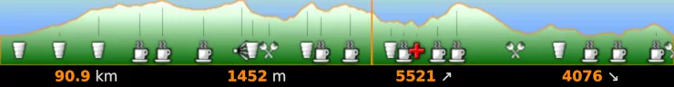
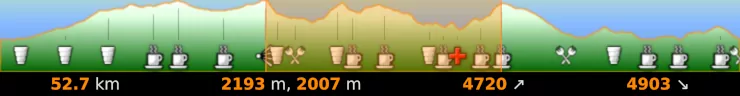
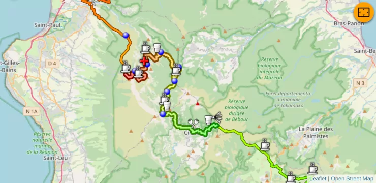

# Mini-profile

There is an interactive mini elevation profile at the bottom of the screen.

Click on it to get some information about a point:

* distance from the start in km,
* altitude in meters,
* cumulative positive elevation in meters,
* and cumulative negative elevation in meters.

By dragging your mouse or your finger, you can highlight a section and get information on it (you will got altitude for the starting and for the ending point):

The selected section will be also highlighted on the map:

----

[Back](#..)
