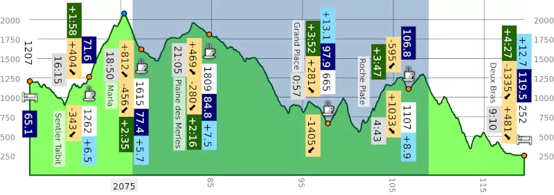

# Profil {{icon name: profil}}

A fully parametrable elevation profile that you can export in PDF format.
Available features are:

* compute time estimations,
* define sunset and sunrise time,
* split the trace in several sections,
* set the font size,
* choose a layout (width and height in mm),
* ...

----

[Back](#..)
